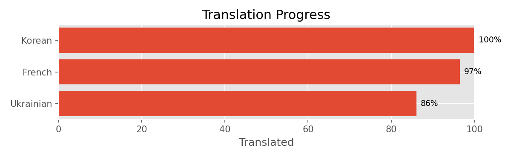

# README Tools

This repository contains various tools to generate charts and images for your repository's README.

# Available Tools

All tools are in the `cli/` directory and can be called from there.

(Everything in the `cli/` directory is a shell script that wraps the Python scripts.)

## Gettext Translation Progress

This tool generates a bar chart showing percent translation complete for gettext PO files.

```txt
usage: readme-pochart [-h] [-0] [-t THEME] inputs [inputs ...] output

Generate translation progress chart from .po files.

positional arguments:
  inputs               Input .po files
  output               Output image path or - for stdout

options:
  -h, --help           show this help message and exit
  -0, --ignore-zeroes  Hide languages with 0.0% translated strings
  -t, --theme THEME    Matplotlib style theme
```

Example: `readme-pochart -0 ./po_fies/*.po ./out.png`



